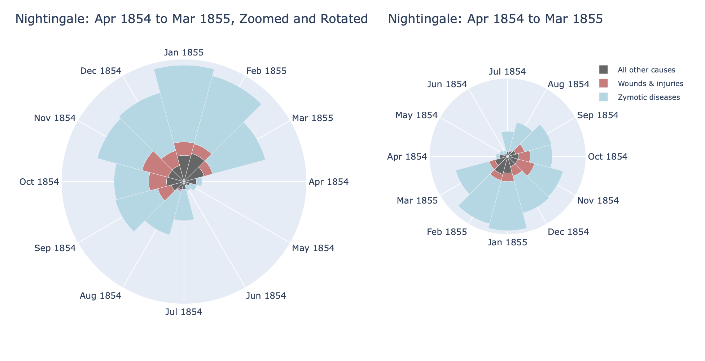
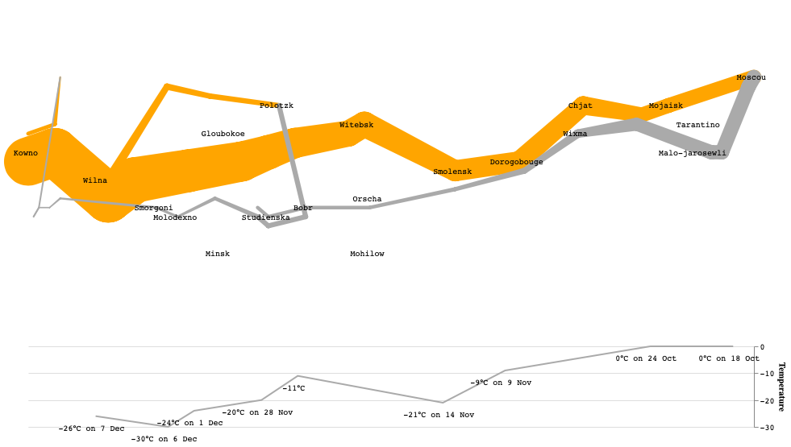

# Minard's Map and Nightingale's Rose Plot Visualisation using Python

### Setting Up

We are using Python 3.7.6 in this project.

Create a python3 virutal environment and activate it.

If you use ```venv```, follow as below to create a virtual environment.

```
python -m venv <Virtual Env Name>
source <Virtual Env Name>/bin/activate
```
If you use ```conda```, follow as below to create the virtual environment.
```
conda create -n <Virtual Env Name> python=3.6
```

Activate and Deactivate before and after working with the project.
```
conda activate <Virtual Env Name>
conda deactivate
```

After that install the required packages using pip,
```
pip install -r requirements.txt
```

### Nightingale's Rose Plot



Nightingale’s rose chart is a depiction of deaths occurred as a result of war and poor hygiene in hospitals. The visualisation clearly shows the fact that more soldiers died from poor hygiene and sanitation in hospitals than the wounds and injuries. The original graph by Nightingale, depicts the Fata from April 1854 to March 1856. This type of visualisation is known as coxcombs, polar bar charts, rose charts etc.

In this project, I’ve tried to visualise one year’s (Apr 1854 to Mar 1855) data as required and shows the both a normal as well as rotated and zoomed (transformation of the normal plot) version. To visualise this, I used python and libraries like _pandas_ to handle the data and cleaning, _plotly_ [1] to plot and visualise using the given data. The colours were chosen in an attempt to closely represent the original visualisation, whose legend is provided at the right side of the visualisation.

The scaling of the data with respect to the average size of the army and total 12 months in a year was done to be able to visualise the smaller data values better in the plot.

### Minard's Map



Minard’s Chart by Charles Joseph Minard, represents Napoleon army’s march and return home from Russia. It involves the visualisation of the temperature as well, as it was the winter during the campaign and it played a huge role leading to the retreat of the army. It has several components to the visualisation like, cities (which contain latitude, longitude, city name), temperature (which contain longitude, date and days), march data (which contains the direction of army, survivor count, latitude and longitude).

In this project, I’ve tried to reproduce Minard’s chart as required and is shown above. The visualisation has two major components, one placed in the upper part of the visualisation, which shows the march and retreat of the soldiers in orange and grey respectively. The thickness of the trail represents the army count in both directions. We also have the city names in the respective locations.

The below part of visualisation represents the temperature during return home and on different dates. The axis on the right represents temperature.

To visualise this I used python and libraries like _pandas_ to handle the data and cleaning, _altair_ [2][3][4] to plot and visualise the given data. The projection used was a _mercator_ projection which is a cylindrical map projection in order to use the longitudes and latitudes meaningfully.


### References

[1] Wind Rose Chart using Plotly, “https://plot.ly/python/wind-rose-charts/”. Last Accessed on 01 Mar 2020.

[2] Altair Encodings, “https://altair-viz.github.io/user_guide/encoding.html”. Last Accessed on 01 Mar 2020.

[3] Altair Marks, “https://altair-viz.github.io/user_guide/marks.html”. Last Accessed on 01 Mar 2020.

[4] Altair Chart Config, “https://altair-viz.github.io/user_guide/configuration.html”. Last Accessed on 01 Mar 2020.
